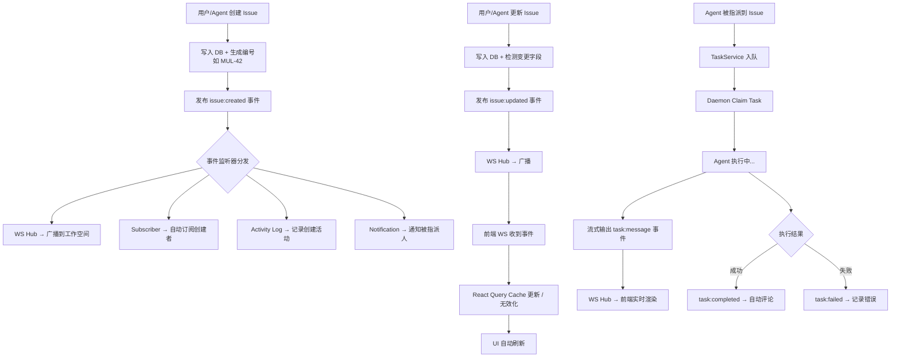
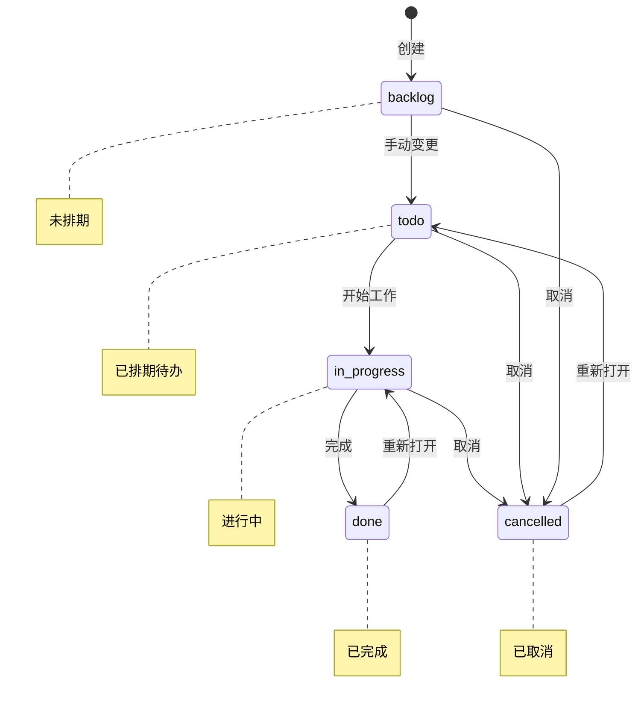
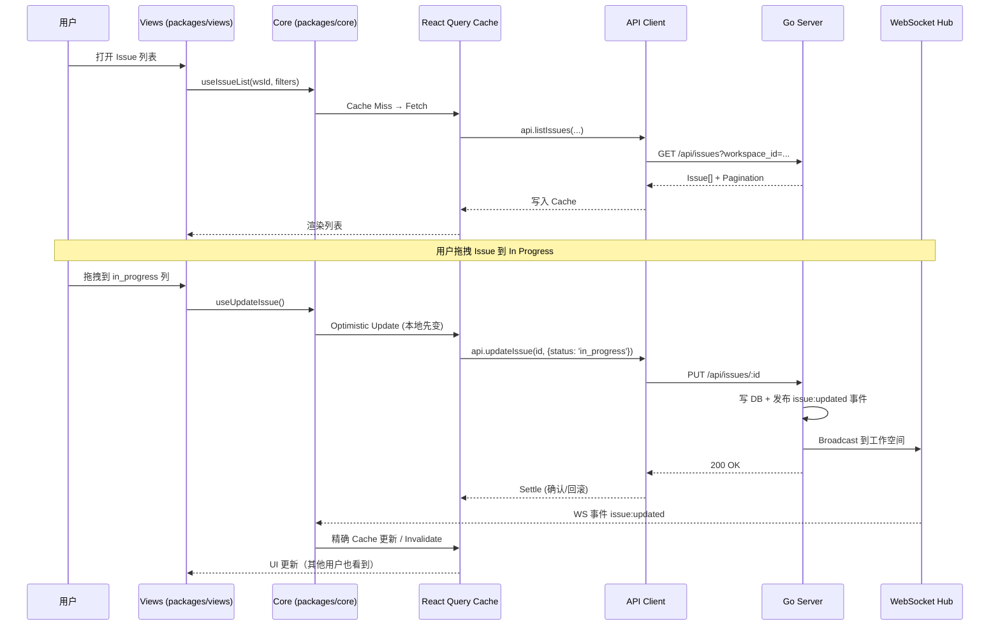
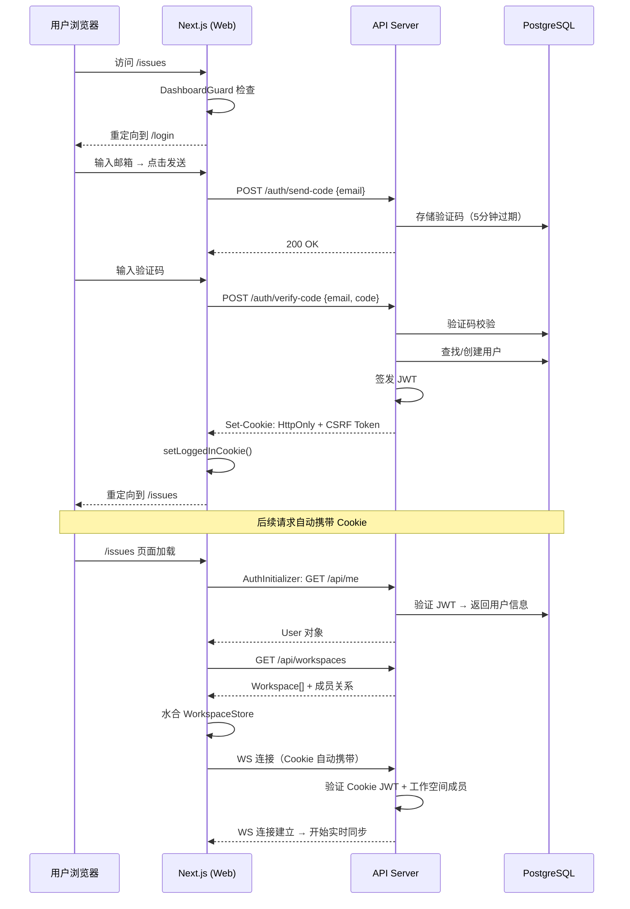
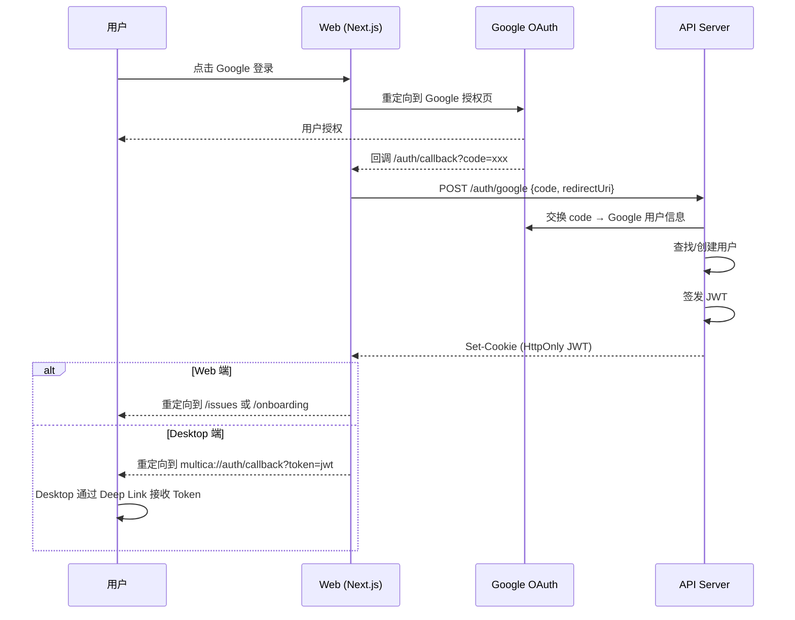
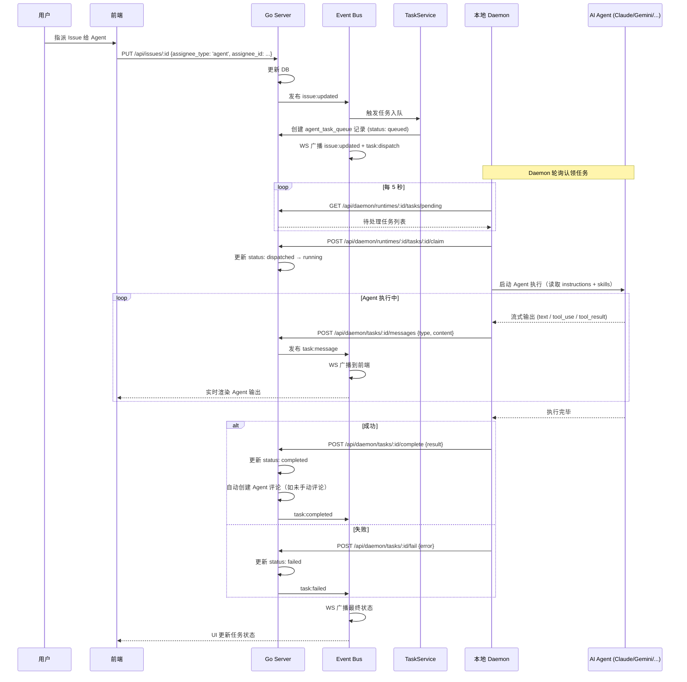
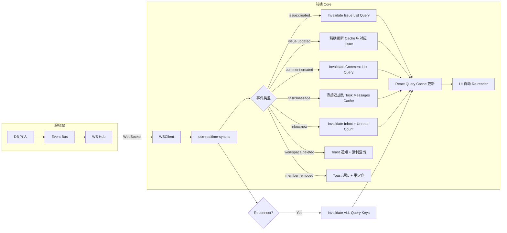
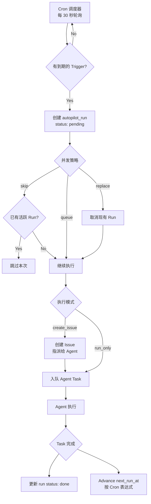

# 核心业务流转图

## 1. Issue 全生命周期

Issue 是系统的核心实体，贯穿了最多的业务逻辑。



### Issue 状态机



### Issue 完整数据流（前端视角）



## 2. 认证与初始化流程

### Web 端认证（Cookie 模式）



### Google OAuth 流程



## 3. Agent 任务执行流程

这是 Multica 最核心的差异化能力 —— Agent 如何从被指派到完成任务的完整链路。



## 4. 实时同步引擎（前端）



## 5. Autopilot 自动化流转



## 6. 多租户隔离模型

```mermaid
flowchart TB
    subgraph 请求进入
        A[HTTP Request] --> B[Auth Middleware<br/>验证 JWT/PAT]
        B --> C[Workspace Middleware<br/>读取 X-Workspace-ID]
        C --> D{Membership Check<br/>DB 查询 member 表}
        D -->|Not Member| E[403 Forbidden]
        D -->|Is Member| F[注入 member 到 Context]
    end

    subgraph 数据隔离
        F --> G[Handler 执行]
        G --> H[sqlc Query<br/>WHERE workspace_id = $N]
        H --> I[仅返回该工作空间数据]
    end

    subgraph WS 隔离
        J[WS 连接] --> K[验证 membership]
        K --> L[加入 workspace Room]
        L --> M[仅接收该 Room 的广播]
    end

    subgraph 存储隔离
        N[Zustand Store] --> O[createWorkspaceAwareStorage]
        O --> P[Key: multica_xxx:{wsId}]
        P --> Q[切换空间时自动 Rehydrate]
    end
```
